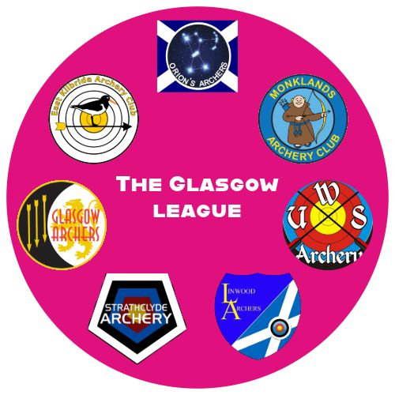

```{r, install}
#install.packages("rmarkdown", "quarto", "tidyverse", "here", "english", "DBI", "duckdb")
```

```{r, setup, include=FALSE}
library(knitr)
library(rmarkdown)
knitr::opts_chunk$set(echo = FALSE)
knitr::opts_chunk$set(fig.width = 8, fig.height = 5)
library(tidyverse)
library(here)
library(english)
source(here("functions", "utility_functions.R"))
```

{width="641"}

This is the place to keep track of what is happening in the Glasgow Archery League, organised by Iain McMillan and the clubs in the league.

See the Events tab for the scores for events that took place at each stage.

## 2025/6 Schedule

+------------+---------------+---------------+----------------------+----------------------+
| Stage      | Date          | Time          | Location             | What3words           |
+============+===============+===============+======================+======================+
| 1          | 5th October   | 9AM - 1PM     | Eastwood High School | fluid.trip.tanks     |
+------------+---------------+---------------+----------------------+----------------------+
| 2          | 1st November  | 12PM - 4:30PM | Time Capsule         | hoping.gloves.shins  |
+------------+---------------+---------------+----------------------+----------------------+
| 3          | 13th December | 10AM - 2PM    | ON-X                 | lure.shredder.tribes |
+------------+---------------+---------------+----------------------+----------------------+
| 4          | 17th January. | 12PM - 4:30PM | Time Capsule         | hoping.gloves.shins  |
+------------+---------------+---------------+----------------------+----------------------+
| 5          | 21st February | 12PM - 4:30PM | Time Capsule         | hoping.gloves.shins  |
+------------+---------------+---------------+----------------------+----------------------+
| 6          | 21st March    | 12PM - 4:30PM | Time Capsule         | hoping.gloves.shins  |
+------------+---------------+---------------+----------------------+----------------------+

## Results

| Position | Club          | Oct | Nov | Dec | Jan | Feb | Mar | Total |
|----------|---------------|-----|-----|-----|-----|-----|-----|-------|
| 1st      | Strathclyde   | 5   | 5   | 4   | 4   | 3   | 5   | 26    |
| 2nd      | Glasgow       | 3   | 4   | 5   | 5   | 5   | 4   | 26    |
| 3rd      | Monklands     | 4   | 3   | 1   | 2   | 4   | 2   | 16    |
| 4th      | East Kilbride | 2   | 2   | 3   | 3   | 2   | 3   | 15    |
| 5th      | Linwood       | 1   | 0   | 2   | 1   | 1   | 0   | 5     |
| 6th      | Orion's       | 0   | 1   | 0   | 0   | 0   | 0   | 1     |
| 7th      | Giffnock      | \-  | \-  | \-  | \-  | \-  | 1   | 1     |
| 8th      | UWS           | \-  | \-  | 0   | 0   | 0   | \-  | 0     |

```{r}
all_archers <- load_all_archer_scores()
scores <- filter(all_archers, score > 0, between(event_date, as.Date('2025-10-01'), as.Date('2026-03-30')))

top4_club_season_scores <- function(data) {
  
  # Ensure score is numeric (in case of any NA or character issues)
  data$score <- as.numeric(data$score)
  
  # Remove rows with missing scores
  data <- data[!is.na(data$score), ]
  
  # Define the grouping for "each event": event_date + location
  # (This distinguishes different sessions even on the same date)
  library(dplyr)
  
  result <- data %>%
    group_by(event_date, location, club) %>%
    # For each club at each event, keep only the top 4 scores
    slice_max(order_by = score, n = 4, with_ties = FALSE) %>%
    # Sum the top 4 for that club-event
    summarise(event_club_score = sum(score), .groups = "drop") %>%
    # Now sum across all events for each club
    group_by(club) %>%
    summarise(total_score = sum(event_club_score), .groups = "drop") %>%
    # Sort by total descending
    arrange(desc(total_score))
  
  return(result)
}
```

### Total Club scores for the season

Here are the total scores, but it is the positions in each stage that count unless there is a tie at the end of the season.

The club scores in each tournament are for the 4 best scores (regardless of bow style).

```{r}
season_totals <- top4_club_season_scores(scores)
knitr::kable(season_totals, col.names = c("Club", "Score"))
```

## League Winners

This year there was a tie between **Glasgow Archers** and **Strathclyde AC**. Therefore, total arrow scores for the top 4 archers of each club at each event was used. Strathclyde scored a total of 13,133 to Glasgow's 13,117.

### The league winner is **Strathclyde Archery Club**.

------------------------------------------------------------------------

### League Winners 2024/5

The winner of the league for the first year was:

#### Strathclyde University.

## League Table

The final results are as follows, leaders at the top:

| Position | Club          | Oct | Nov | Dec | Jan | Feb | Mar | Total |
|----------|---------------|-----|-----|-----|-----|-----|-----|-------|
| 1st      | Strathclyde   | 2   | 5   | 5   | 5   | 5   | 5   | 27    |
| 2nd      | Glasgow       | 5   | 4   | 4   | 4   | 4   | 4   | 25    |
| 3rd      | East Kilbride | 4   | 3   | 3   | 3   | 2   | 2   | 17    |
| 4th      | Monklands     | 3   | 2   | 2   | 1   | 3   | 3   | 14    |
| 5th      | Orion's       | 1   | 1   | 1   | 0   | 1   | 0   | 4     |
| 6th      | Linwood       | 0   | 0   | 0   | 2   | 0   | 1   | 3     |
| 7th      | UWS           | 0   | 0   | 0   | 0   | 0   | 0   | 0     |

+------------------------------------+----------------+
| Club Position in event             | Ranking points |
|                                    |                |
| (top four archers combined scores) |                |
+====================================+================+
| 1st                                | 5              |
+------------------------------------+----------------+
| 2nd                                | 4              |
+------------------------------------+----------------+
| 3rd                                | 3              |
+------------------------------------+----------------+
| 4th                                | 2              |
+------------------------------------+----------------+
| 5th                                | 1              |
+------------------------------------+----------------+
| All others                         | 0              |
+------------------------------------+----------------+

If the rank totals are tied, then the total scores of the top four archers at each event are used to break the tie. In the unlikely event that these scores too are tied, then the matter cannot be settled by bows, and it is pistols at dawn.

If, at the end of a season, two clubs have the same number of match points, total arrow scores of the top four archers at each event (the same scores used for position) is used.
